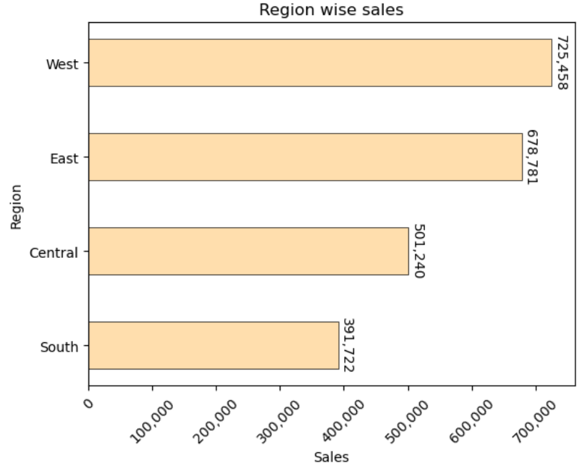
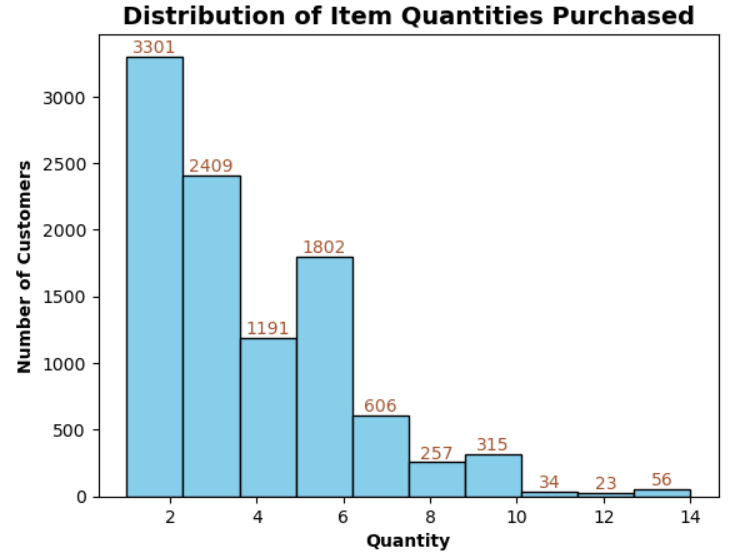
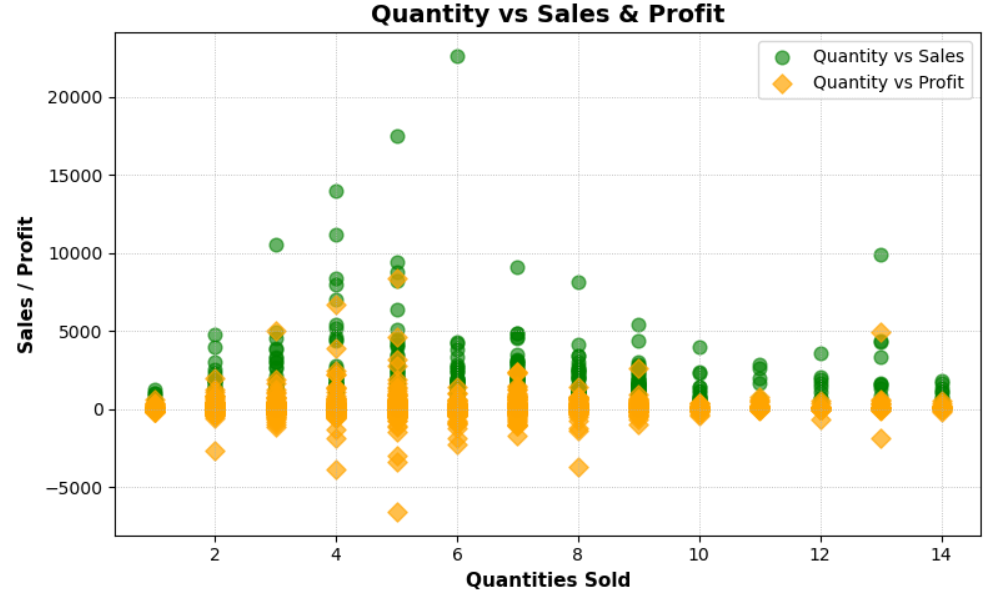

# 📊 Data Analysis using Matplotlib and Seaborn

Purpose:
- Practice data visualization on sales dataset
- Analyse trends through bar charts, line plots, and categorical plots

## 🧠 Key Skills Demonstrated
- Pandas data manipulation
- Matplotlib figure formatting
- Seaborn styling

## Screenshots of plots

# Line chart

# Bar chart

# Pie chart

# Histogram chart

# Scatter plot

