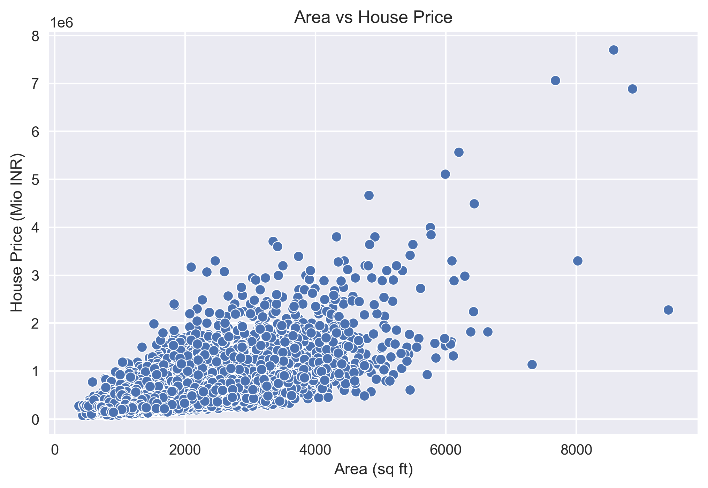
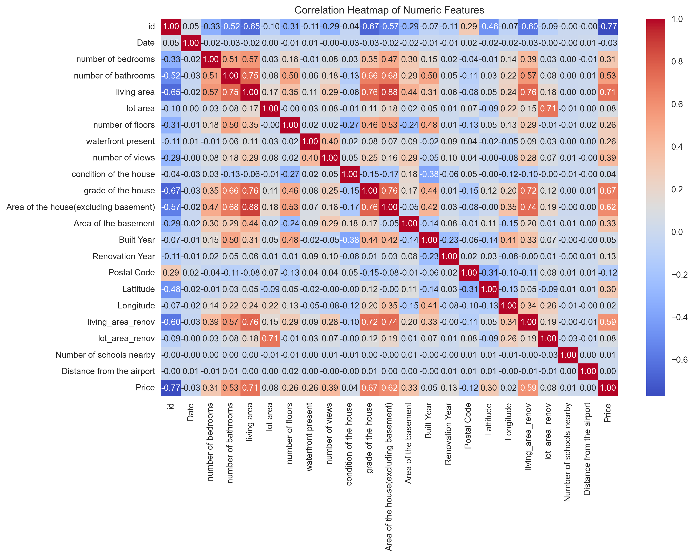
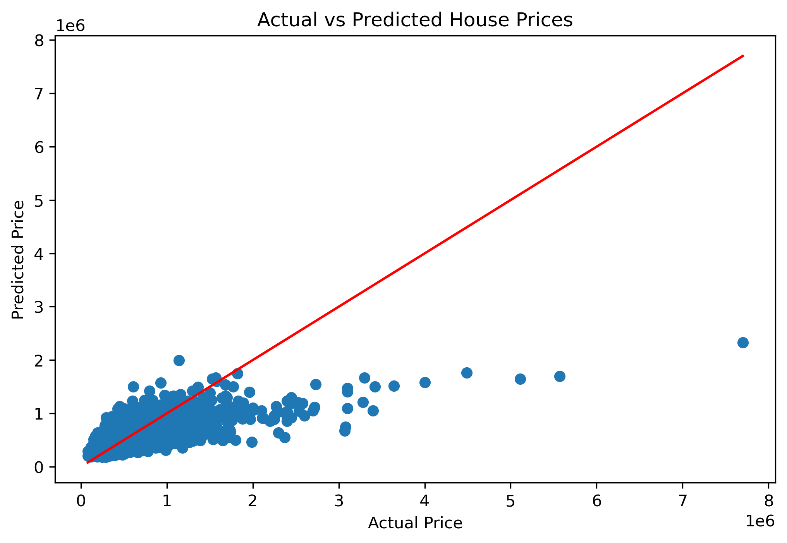
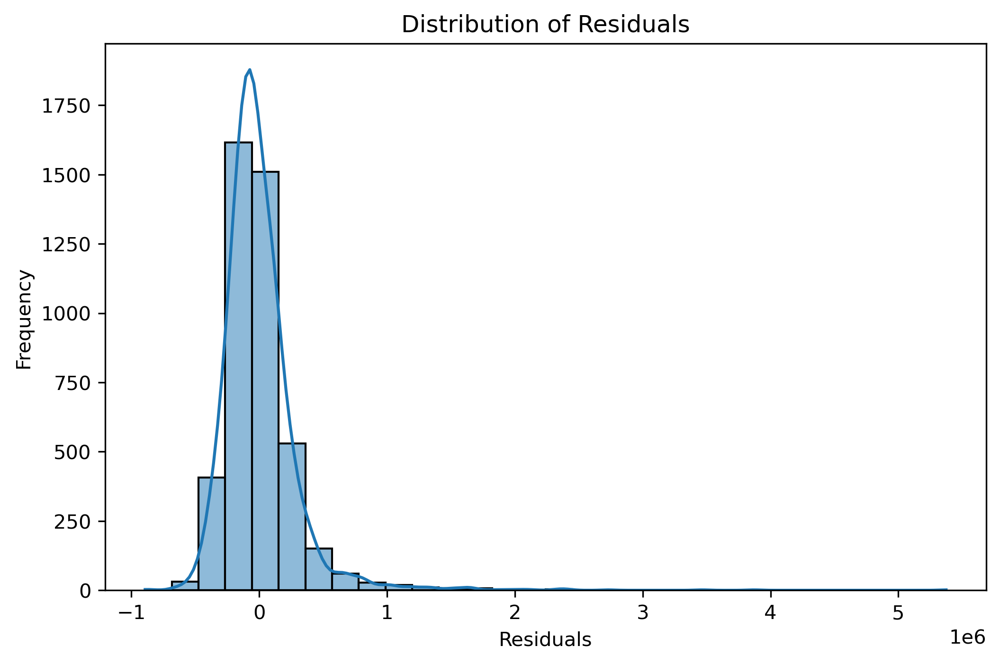

# 🏠 House Price Prediction – India (Linear Regression)

## 📌 Project Overview
This project builds an end-to-end **Linear Regression model** to predict house prices in India based on property area.  
It demonstrates a complete **machine learning workflow**, from data analysis to model evaluation, with strong emphasis on **business understanding and interpretability**.

The project is designed to showcase:
- Data analysis & visualization
- Statistical reasoning
- Model training & evaluation
- Clean project structuring

---

## 🎯 Business Objective
To develop a **baseline pricing model** that can:
- Estimate house prices based on area
- Help stakeholders understand key price drivers
- Serve as a foundation for more advanced models

---

## 📂 Project Structure
01_linear_regression_house_price/ 
│  
├── images/  
│ ├── price_distribution.png  
│ ├── area_vs_price.png  
│ ├── correlation_heatmap.png  
│ ├── actual_vs_predicted.png  
│ └── residual_distribution.png  
│  
├── 01_data_analysis.ipynb  
├── 02_data_preprocessing.ipynb  
├── 03_model_training.ipynb  
├── 04_model_evaluation.ipynb  
└── README.md  

---

## 📊 Exploratory Data Analysis (EDA)

### 🔹 Price Distribution

  

**Insight:**  
House prices show a right-skewed distribution, indicating the presence of premium properties that influence the average price.

---

### 🔹 Area vs Price Relationship

  

**Insight:**  
There is a strong positive relationship between property area and price, making the dataset suitable for Linear Regression.

---

### 🔹 Correlation Heatmap

  

**Insight:**  
Numeric features show varying degrees of correlation with house prices, supporting informed feature selection.

---

## 🧹 Data Preprocessing
Key preprocessing steps include:
- Capping outliers using the IQR method
- Feature scaling
- Train–test split

**Why this matters:**  
Ensures stable, unbiased, and reliable model performance.

---

## 🤖 Model Training – Linear Regression
A Linear Regression model was trained using **property area** as the independent variable.

### 🔹 Actual vs Predicted Prices

  

**Insight:**  
Predictions closely follow actual values for mid-range properties, indicating a good baseline fit.

---

## 📈 Model Evaluation & Diagnostics

### 🔹 Residual Distribution

  

**Insight:**  
Residuals are centered around zero with near-normal distribution, suggesting minimal bias and acceptable model assumptions.

---

## 📏 Performance Metrics
- **MAE:** Average absolute prediction error  
- **RMSE:** Penalizes larger errors  
- **R² Score:** Measures explanatory power of the model  

These metrics indicate the model performs reasonably well as a **baseline estimator**.

---

## 🧠 Key Learnings
- Area of the house is a strong driver of house prices
- Linear Regression provides interpretability and transparency
- Outlier handling significantly improves model stability
- Residual analysis is critical before real-world deployment

---

## 🛠️ Tools & Technologies
- **Python**
- **pandas, numpy**
- **matplotlib, seaborn**
- **scikit-learn**
- **Jupyter Notebook**

---

## 👤 Author
**Sitaram Dalvi**  
AI / ML Enthusiast | Project Management Professional  

---

## ⭐ Why This Project Matters
This project demonstrates not just model building, but **end-to-end ML thinking**, combining:
- Technical execution
- Statistical understanding
- Business interpretation
- Clean documentation

It reflects real-world practices used in production ML projects.

